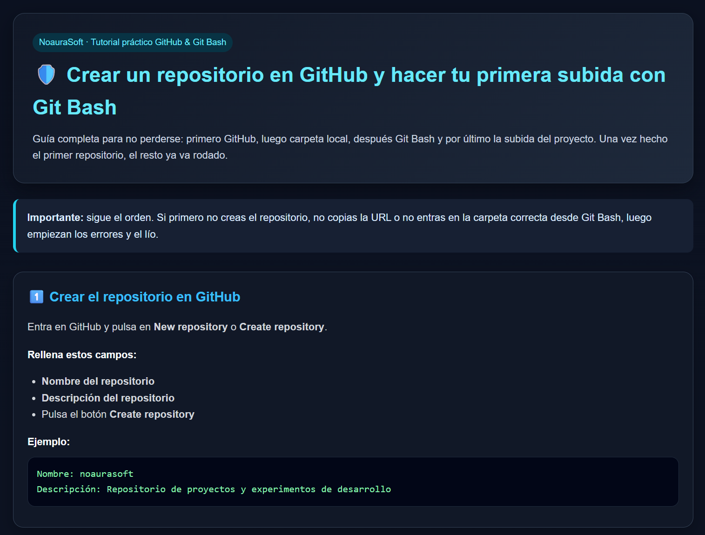

<p align="center">
  
</p>

<h1 align="center">Tutorial Crear un repositorio en GitHub y hacer tu primera subida con Git Bash</h1>

<p align="center">
Guía visual para aprender <b>Git y GitHub usando Git Bash</b>, explicada paso a paso.<br>
Incluye una pequeña web interactiva creada con <b>HTML, CSS y JavaScript</b>.
</p>

---

## Demo

👉 **Ver el tutorial interactivo:**  
https://noa863.github.io/EurofirmsClases2026/Tutorial-git-bash/

---

## Tecnologías utilizadas

<p align="center">


</p>

---

# 📂 Contenido del tutorial

Este tutorial explica el **flujo completo de Git desde cero**, incluyendo:

### Creación del repositorio

- Crear un repositorio en GitHub  
- Copiar la URL del repositorio  
- Preparar el proyecto en local  
- Crear la estructura de carpetas  

### Trabajo desde Git Bash

- Inicializar repositorio (`git init`)  
- Añadir archivos (`git add`)  
- Crear commits (`git commit`)  
- Cambiar rama principal (`git branch -M main`)  
- Conectar repositorio local con GitHub (`git remote add origin`)  
- Subir proyecto (`git push`)  

### Verificación del repositorio

- Comprobar estado (`git status`)  
- Revisar cambios antes de subir  

---

# 🔄 Flujo de trabajo diario

Después de crear el repositorio, el flujo normal de trabajo será:

```bash
git add .
git commit -m "Descripción del cambio"
git push
```

Este es el flujo básico que utilizan la mayoría de desarrolladores cuando trabajan con Git.

---

## Vista del proyecto



---

## Cómo usar el proyecto

### 1️⃣ Clona el repositorio

```bash
git clone https://github.com/Noa863/EurofirmsClases2026.git
```

### 2️⃣ Entra en la carpeta del tutorial

```bash
cd EurofirmsClases2026/Tutorial-git-bash
```

### 3️⃣ Abre el archivo en tu navegador

```
index.html
```

---

## Objetivo del proyecto

Este proyecto está pensado para personas que quieren aprender **Git y GitHub desde cero de forma clara, práctica y visual**.

El tutorial está construido como una pequeña **web interactiva**, para que los estudiantes puedan copiar comandos directamente y entender el flujo real de trabajo.

---

## Autora

**Noa Antonio García**

Arquitecta  
Desarrollo web • Inteligencia artificial • Arquitectura de software

---
## Licencia

MIT License Noa Antonio García

© 2026 **NoauraSoft**