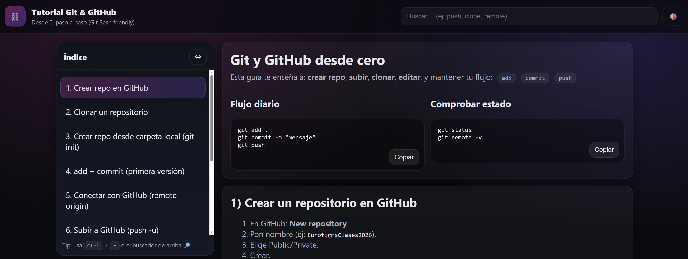

<p align="center">
  
</p>

<h1 align="center">📚 Tutorial Git y GitHub desde cero</h1>

<p align="center">
Guía visual para aprender <b>Git y GitHub usando Git Bash</b>, explicada paso a paso.<br>
Incluye una pequeña web interactiva creada con <b>HTML, CSS y JavaScript</b>.
</p>

---

## Demo

👉 **Ver la demo:**  
https://noa863.github.io/EurofirmsClases2026/Tutorial-git/

---

## Tecnologías utilizadas

<p align="center">


</p>

---

## 📂 Contenido del tutorial

- Crear repositorio en GitHub  
- Clonar repositorio  
- Inicializar repositorio (`git init`)  
- Añadir archivos (`git add`)  
- Crear commits (`git commit`)  
- Subir cambios (`git push`)  
- Descargar cambios (`git pull`)  
- Cambiar repositorio remoto (`git remote`)  

---

## Vista del proyecto



---

## Cómo usar el proyecto

1️⃣ Clona el repositorio

```bash
git clone https://github.com/Noa863/EurofirmsClases2026.git
```

2️⃣ Entra en la carpeta

```bash
cd EurofirmsClases2026/Tutorial-git
```

3️⃣ Abre el archivo

```
index.html
```

---

Este proyecto está pensado para personas que quieren aprender **Git desde cero de forma clara, práctica y visual**.

---

Proyecto creado por **Noa Antonio García**  
© 2026 Noaurasoft